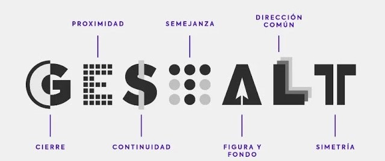

# Procedural

## Introducción

Por medio de el ejercicio vamos a buscar entender algunos efectos que ocurren con las ilusiones Opticas  sus relaciones y caracteristicas, para poder utilizarlas a nuestro favor cuando sean requeridas. 

## Teoria y Transfondo

### Ilusiones Opticas

Una ilusión optica es una ilusión causada por el sistema visual y caracterizada por una percepción visual que parece diferir de la realidad. 
La mayor forma de diferenciarlas es por medio de los principios de percepcion que se usan para entenderlas, conocidos como las Leyes de Gestalt.

Tambien se a de notar que algunas ilusiones se pueden dividir respecto a si varian respecto al tiempo o no.

### Leyes de  Gestalt:

Son principios que  buscan explicar como y cuanod nuestra mente percibe diversos componentes visuales como parte de un grupo, lo que nos ayuda a notar por que se generan las diversas ilusiones visuales.

#### Semejanza:

El principio de Semejanza permite unir elementos por medio de sus similitudes, ya sean en Color, Forma, Tamaño o en Textura, esto no solo permite agrupar objetos en grupos similares, sino que resalta aquellos objetos que no son parte de esta similitud.

#### Continuidad:

El ojo crear la continuidad de una linea, para seguir el camino mas suave y coherente, es util a la hora de apuntar a un elemento, o guiar la vista en una direccion.

#### Cierre:

Cuando Percibimos una figura que no esta completa, o esta delimitada por bordes, nuestra mente transmite una sensacion de figura completa. Este principio se junta con el de figura fondo, para mayor entendimiento.

#### Proximidad:

Al igual que con el principio de la semejanza tendemos a agrupar objetos segun su proximidad en objetos que comparten caracteristicas en comun: forma, color, tamaño o textura. 

#### Figura Fondo:

De Forma similar al principio de cierre el principio figura fondo dice que el ojo humano busca separar el objeto de su fondo, por lo que no puede percibirlo como figura y como fondo a la vez, permitiendo separar varias figuras en una misma imagen.

#### Simetria y orden:

Una Forma de agrupar figuras es por medio de un orden o con simetria, buscando simplificar las figuras dandoles un orden, que es lo que suele buscar el ojo, formas simples y estables.

#### Direccion Comun:

Este principio no estaba en un principio pero fue agregado por su importancia, donde las figuras que siguen un patron (como en el principio de la simetria) o un flujo o movimiento son percibidos a su vez como un grupo.

## Codigo.

Tenemos 2 codigos que buscan mostrar laas ilusiones escogidas de la pagina [VisualIlusions](https://michaelbach.de/ot/index.html),  con 2 ilusiones cada 1, La primera son ilusiones de movimientos "Stepping feet" y "Pidgeon Neck", la segunda con ilusiones de percepcion y profundidad, que muestran como nuestra experiencia nos hace percibir formas de tamaño diferente en figuras iguales segun su fondo, teniendo las ilusiones de "Shepard’s Rotated Tables" y "Size Constancy".

### La primera implementacion:




var speedr, bar,piece;
var StepFetP,StepFetD;
var PidNeckP;
var cMOde;
var grids;
function setup() {
  createCanvas(500, 500);
  speedr=0.5;
  bar = 7;
  piece=10;
  StepFetP=0;
  StepFetD=1;
  cMOde=0;
  grids=true;
  grid= new Button(' GRID ',0,0);
  grid.colore=color(200,100,100);
  grid.mousePressed(grisdy);
  PidNeckP = [['l',0,150],['l',350,470],['p',-piece,250],['p',150,350],['p',300,150]]
  
  colors = new Button(' COLOR ',100,0);
  
  colors.colore=color(100,100,200);
  
  colors.mousePressed(cModer);
  
  
  
  noStroke();
}

function draw() {
  background(255);
  if(grids){
    backi();
  }
  SteppingFeet();
  PigeonNeck();
  grid.draw();
  colors.draw();
}

function mousePressed(){
  colors.Pressed();
  grid.Pressed();
}

function mouseReleased(){
  colors.released();
  grid.released();
}

function backi(){
  fill(0)
  for(let i = 0;i<width;i=i+2*bar){
    rect(i,0,bar,height);
  }
}

function SteppingFeet(){
  switch(cMOde){
    case 0:
      fill(0,0,255);
      break;
    case 1:
      fill(76,0,0);
      break;
    case 2:
      fill(0);
      break;
  }
  rect(StepFetP,25,piece*bar,25);
  
  switch(cMOde){
    case 0:
      fill(255,255,0);
      break;
    case 1:
      fill(0,229,0) ;
      break;
    case 2:
      fill(255);
      break;
  }
  rect(StepFetP,75,piece*bar,25);
  
  StepFetP=StepFetP+StepFetD*speedr
  if(StepFetD>0&&StepFetP+piece>width){
    StepFetD=-1;
  }else if(StepFetD<0&&StepFetP<0){
    StepFetD=1;
  }
}

function PigeonNeck(){
  switch(cMOde){
    case 0:
      fill(0,0,255);
      break;
    case 1:
      fill(255,51,0) ;
      break;
    case 2:
      fill(170);
      break;
  }
  for(let i=0;i<PidNeckP.length;i++){
    if('l'==PidNeckP[i][0]){
      rect(PidNeckP[i][1],PidNeckP[i][2],bar*20,25);
    }else{
      Pidgeon(PidNeckP[i][1],PidNeckP[i][2]);
    }
    PidNeckP[i][1]=PidNeckP[i][1]+speedr
    if(PidNeckP[i][1]>width){
      PidNeckP[i][1]=0
    }
  }
  
}

function Pidgeon(x,y){  
  translate(x,y);
  rect(9*bar,0,6*bar,6*bar)
  rect(15*bar,4*bar,2*bar,2*bar)
  rect(8*bar,6*bar,6*bar,10*bar)
  rect(6*bar,8*bar,6*bar,8*bar)
  rect(4*bar,10*bar,6*bar,6*bar)
  rect(2*bar,12*bar,6*bar,4*bar)
  rect(0,14*bar,6*bar,2*bar)
  rect(8*bar,14*bar,2*bar,6*bar)
  rect(8*bar,20*bar,4*bar,1*bar)
  
  
  translate(-x,-y);
  
  
}

class Button{
    constructor(label,x,y){
	this.x=x
	this.y=y
    this.w=10*label.length;
    this.h=20;
	this.label=label
    this.colore = color(200, 200, 200);
    this.isPressed= false
    this.alpha= function() {}
    }
	draw(){
      noStroke()
      var bart = this.colore
      if(this.isPressed){
        bart = lerpColor(bart, color(0,0,0), 0.5);
      }
      fill(bart)
      rect(this.x,this.y,this.w,this.h)
      fill(0)
      textWidth(1)
      text(this.label,this.x+this.w/10,this.y+this.h/3*2)
    }
  
    mousePressed(alpha = null){
      this.alpha=alpha
    }
  
    Pressed(){
      if(mouseX>this.x && mouseX<this.x+this.w &&mouseY>this.y && mouseY<this.y+this.h){
        this.isPressed=true;
        this.alpha()  
      }
      
    }
  
    released(){
      this.isPressed=false;
    }
    color(colos){
      this.colore= colos
    }
}

function grisdy(){
  grids=!grids;
}

function cModer(){
  cMOde++;
  if(cMOde>2){
    cMOde=0;
  }
}




La ilusion se basa en la semejanza de contrastes entre las figuras y alguno de los colores del fondo de la malla, permitiendo dar la ilusion de pasos con la ilusion de arriba, y la percepcion de alargue o movimiento en las figuras de abajo, esto por los principios de figura fondo, semejanza y continuidad, lo que nos hace percibir que las figuras se detienen en el avance cuando el fondo tiene un contraste similar.

Por parte del codigo solo se dibujaron las figuras y se les dio movimiento, ademas de dibujar la malla en el fondo, el cambio de color se tomo de la pagina con la ilusion para mostrar diversos opciones con el mismo efecto.

### La segunda implementacion:




let table,car,backgro;
let refy,refA;
let backy;
let backx;
let mode,visu;
function preload() {
  table = loadImage('tables.png');
  car = loadImage('car1.png');
  backgro = loadImage('car2.png');
  
}
function setup() {
  createCanvas(630,403)
  refy=0;
  refA=0;
  backy=0;
  backx=0;
  fill(200)
  mode=true;
  vise=0;
  EXAMPLES = new Button(' EXAMPLE ',0,0);
  EXAMPLES.mousePressed(moder)
  moders = new Button(' PARTS ',95,0);
  moders.mousePressed(visual)
  
}

function draw(){
  background(255);
  if(mode){
    if(vise<2){
      image(table, 0, 0, width, height);
    }
    if(vise%2==0){
      tabler();
    }
  }else{
    if(vise==2){
      vise=0;
    }
    if(vise==0){
      image(car, 0, 0, width, height);
    }
    if(vise==1){
      image(backgro, 0, 0, width, height);
    }
    
  }
  EXAMPLES.draw()
  moders.draw()
}

function tabler(){
  fill(200,200,100)
  translate(100,470+refy);
  rotate(refA);
  beginShape();
  vertex(-54,-205);
  vertex(72,-199);
  vertex(132,-463);
  vertex(10,-460);  
  endShape(CLOSE);
  rotate(-refA);
  translate(-100,-470-refy);
}

function mousePressed(){
  if(mode){
    backy=mouseY;
    backx=mouseX;
  }
  EXAMPLES.Pressed()
  moders.Pressed()
}

function mouseReleased(){
  EXAMPLES.released()
  moders.released()
}

function mouseDragged(){
  if(mode&&vise%2==0){
    refy=refy-backy+mouseY;
    backy=mouseY;
    refA=refA-(backx-mouseX)*PI/width*2
    backx=mouseX;
  }
}

class Button{
    constructor(label,x,y){
	this.x=x
	this.y=y
    this.w=10*label.length;
    this.h=20;
	this.label=label
    this.colore = color(200, 200, 200);
    this.isPressed= false
    this.alpha= function() {}
    }
	draw(){
      noStroke()
      var bart = this.colore
      if(this.isPressed){
        bart = lerpColor(bart, color(0,0,0), 0.5);
      }
      fill(bart)
      rect(this.x,this.y,this.w,this.h)
      fill(0)
      textWidth(1)
      text(this.label,this.x+this.w/10,this.y+this.h/3*2)
    }
  
    mousePressed(alpha = null){
      this.alpha=alpha
    }
  
    Pressed(){
      if(mouseX>this.x && mouseX<this.x+this.w &&mouseY>this.y && mouseY<this.y+this.h){
        this.isPressed=true;
        this.alpha()  
      }
      
    }
  
    released(){
      this.isPressed=false;
    }
    color(colos){
      this.colore= colos
    }
}

function moder(){
  mode=!mode
  vise=0
}

function visual(){
  vise++
  if(vise>2){
    vise=0;
  }
}




La ilusion muestra 2 casos de la imagen las mesas rotadas de Shepard y el concepto de tamaño constante, como se menciono ambos varian la percerpcion por el principio de orden, debido a que el fondo es una imagen de tres dimensiones, percibimos toda la imagen con esas dimensiones, haciendonos percibir figuras iguales como distintas por como se ven en el fondo.

El codigo solo exporta las imagenes utilizadas, y permite rotar la figura que muestra la igualdad de tamaño en las mesas.

## Resultados

Ilusion de movimientos.




## Conclusiones 

- las ilusiones visuales son utiles a la hora de notar los conceptos que existen en todas las imagenes que existen, entender como usando una imagen plana podemos percibir todo un universo que sentimos vivo con profundidad.

## Trabajos Futuros

Se podria realizar una implementacion con ilusiones que muestren de forma mas especifica cada principio de Gestalt, aunque algunos de los tratados ya existen.

## Resources

- [Leyes Gestalt](https://imborrable.com/blog/teoria-de-la-gestalt/)

- [ilusiones Visuales](https://michaelbach.de/ot/index.html)

- [Pigeon Neck](https://michaelbach.de/ot/mot-pigeonNeck/index.html)

- [Size Constancy](https://michaelbach.de/ot/sze-sizeConstancy/index.html)

- [Stepping feet](https://michaelbach.de/ot/mot-feetLin/index.html)

- [Shepard’s Rotated Tables](https://michaelbach.de/ot/sze-ShepardTables/index.html)
